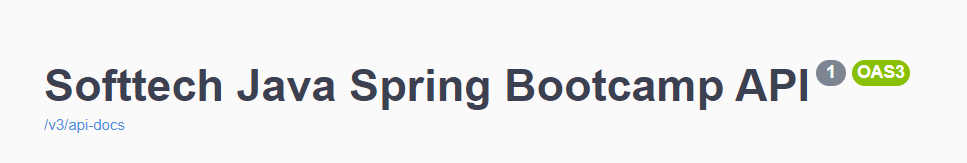
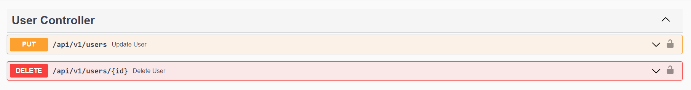
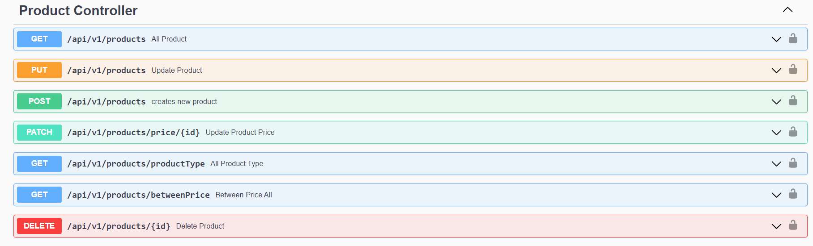
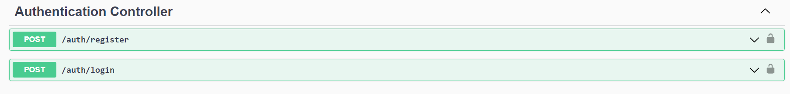
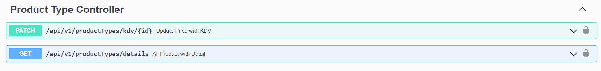

# Softtech Spring Boot Final Projesi

## Kullanılan Teknolojiler

- Java 11
- Spring Boot
- Spring Data JPA
- Restful API
- Swagger documentation
- MapStruct
- Lombok
- PostgreSQL
- JUnit Mockito
- Maven

### Projeyi çalıştırmak için

Repoyu bilgisayarınıza clonelayın. Postgrede, resourcenin altındaki application.properties'den postgre ayarlarınız yapın
ve orada verilmiş olan ad ile postgre de bir database oluşturun. Daha sonra projede meaven clean install yapın

```ssh

git clone https://github.com/165-Softtech-Patika-Java-Spring/bitirmeprojesi-DilberrAslann.git

$ cd credit-application-system/backend
$ mvn clean install
$ mvn spring-boot:run


``` 

Projeyi ayağa kaldırdıktan sonra PostgreSQLde aşağıdaki sorguyu çalıştırın.

```ssh
INSERT INTO prd_product_type (id, name, kdv) VALUES (1, 'FOOD', 1 ),(2,'STATIONARY', 8),(3,'CLOTHES', 8),(4, 'TECHNOLOGY', 18),(5, 'CLEANING', 18), (6,'OTHER', 18);

```

## Projeyi Swagger UI da çalıştırmak için

`http://localhost:${8080}/swagger-ui.html`

## Api Endpoints







# Project Details

# Bitirme Projesi

Projenin Konusu:
Bir marketteki ürünlerin satış fiyatlarına göre son fiyatlarını belirleyen servisin Spring Boot Framework kullanılarak
yazılması ve isteğe bağlı olarak önyüzünün yazılması.

> **Gereksinimler:**

> **Backend:**

- Kullanıcıdan kullanıcı adı, şifre, isim, soy isim bilgilerini alarak sisteme kayıt yapılır.
- Sisteme kayıtlı kullanıcılar market ürünlerinin veri girişini yapabilir.
- Ürün türlerine göre KDV oranları değişiklik göstermektedir. Bu oranlar aşağıdaki tabloda belirtilmiştir. __**Zaman
  zaman KDV oranları değişiklik gösterebilmektedir.**__


- Ürün için veri girişi yapacak kullanıcı; ürünün adı, ürünün türü ve vergisiz satış fiyatı alanlarını doldurur. Her bir
  ürün için KDV Tutarı ve ürünün son fiyatı da hesaplanarak sisteme kaydedilir.

> **Kurallar ve gereksinimler:**

- Sisteme yeni kullanıcı tanımlanabilir, güncellenebilir ve silinebilir.
- Sisteme yeni ürünler tanımlanabilir, güncellenebilir ve silinebilir.
- Ürünlerin fiyatları güncellenebilir.
- KDV oranları değiştiğinde sistemdeki ürünlere de bu değişiklik yansıtılmalıdır. Herhangi bir hata durumunda tüm
  işlemler geri alınmalıdır.
- Tüm ürünler listelenebilmelidir.
- Ürün türlerine göre ürünler listelenebilmelidir.
- Belirli bir fiyat aralığındaki ürünler listelenebilmelidir.
- Ürün türlerine göre aşağıdaki gibi detay veri içeren bir bilgilendirme alınabilmelidir.


> Validasyonlar:

- Aynı kullanıcı adı ile kullanıcı tanımı yapılamaz.
- Kullanıcı girişi kullanıcı adı & şifre kombinasyonu ile yapılır.
- Ürün türü, fiyatı, adı gibi alanlar boş olamaz.
- Ürün fiyatı sıfır ya da negatif olamaz.
- KDV oranı negatif olamaz.

> Authentication:

- Güvenli endpointler kullanınız. (jwt, bearer vs. )

> Response:

- Başarılı ve başarısız responselar için modeller tanımlayın ve bunları kullanın.

> Dökümantasyon:

- Open API Specification (Swagger tercih sebebi)

> Exception Handling:

- Hatalı işlemler için doğru hata kodlarının dönüldüğünden emin olunuz.

> Test:

- Unit ve integration testleri yazınız. 
